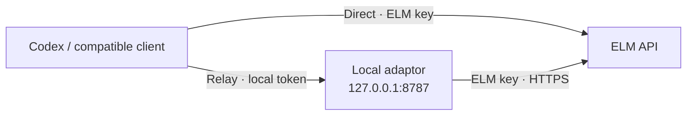

<div align="center">

# ELM Bearer API Adaptor

### Bring your ELM API key into your coding workflow.

Connect Codex to the University of Edinburgh's ELM API.<br>
Read files, make edits, run tests — and switch supported models inside VS Code.

[](https://github.com/YuyangXueEd/ELM_Bearer_API_Adaptor/actions/workflows/test.yml)
[](package.json)
[](LICENSE)
[](#compatibility)

**[Easy Windows setup](#easy-start-on-windows)** · **[Manual setup](#quick-start)** · **[VS Code guide](clients/vscode/README.md)** · **[PyCharm guide](clients/pycharm/README.md)** · **[Test results](docs/VERIFICATION-2026-09-10.md)**

</div>

---

**Your editor. Your ELM access. A working path from prompt to tested code.**

ELM Bearer API Adaptor provides connection diagnostics, ready-to-use Codex configuration templates, and an optional local streaming relay. Codex supplies the coding tools; this project connects those tools to ELM.

> **Verified in the VS Code UI:** ELM routing, file reads, code edits, test execution, and switching from GPT-5.5 to GPT-5.2. Start with a disposable project. PyCharm's ACP transport has passed separate checks; its IDE workflow is still awaiting testing.

## Why use it?

| | What you get |
|---|---|
| **Code with your ELM access** | Connect the official Codex extension to an ELM model available to your account. |
| **Check the connection first** | Discover model IDs and optionally test streaming plus a function-call round trip before configuring your IDE. |
| **Keep credentials separate** | In relay mode, the IDE uses a local token while the relay holds your upstream ELM key. |
| **Switch models in the plugin** | GPT-5.5 → GPT-5.2 switching was verified in the same VS Code conversation, with ELM routing preserved. |
| **Start small** | The relay and diagnostics use Node.js built-ins: no runtime dependencies, database, or build step. |
| **Launch without terminal commands** | A Windows setup dialog handles key entry, project selection, account model discovery and an isolated VS Code profile. Direct mode needs no Node.js or relay. |
| **Follow an IDE-specific guide** | Separate VS Code and PyCharm folders, with configuration examples and explicit verification steps. |

## A coding workflow, verified

The following is a **summary of the actual Windows UI test**, not a simulated demo:

```text
VS Code · Codex · ELM · GPT-5.5

1. Read README.md and add.py
   → Found the verification word from the file.
   → Identified the bug: add(2, 3) returned -1.

2. Fix the function and add tests
   → Changed "return a - b" to "return a + b".
   → Created test_add.py.
   → Ran python -m unittest -v: 3 tests passed.

3. Select GPT-5.2 from the plugin menu
   → Provider remained ELM.
   → Ran the tests again: 3 tests passed.
```

Routing was checked against both **session metadata** and **successful relay requests**. File changes and tool execution results were inspected independently. [Read the evidence →](docs/VERIFICATION-2026-09-10.md)

## Easy start on Windows

**[Download ZIP](https://github.com/YuyangXueEd/ELM_Bearer_API_Adaptor/archive/refs/heads/main.zip) → Extract All → double-click `Start ELM.cmd`**

1. Enter your ELM API key and choose a project folder.
2. Click **Load models** to fetch the full list available to your account, then choose your starting model.
3. Click **Open ELM in VS Code**.

No Node.js, Git, running relay or manual TOML edits are needed for this path. You still need VS Code and the official Codex extension, and must complete Codex's own first-run sandbox setup. The launcher offers optional Windows-encrypted key storage and keeps your normal Codex settings separate.

The full account list includes models that may not support Codex tools. GPT-5.5 and GPT-5.2 have passed our earlier UI tests. This launcher selects the starting model; it does not replace the plugin's own model picker.

**[Open the Windows setup guide →](clients/vscode/EASY-START.md)**

## Quick start

Prefer the command line, a relay, or PyCharm? Use the manual path below.

You need **Node.js 22+**, your own **ELM API key**, and an IDE/client to connect. Each user needs their own ELM access and model permissions.

### 1. Get the project

```sh
git clone https://github.com/YuyangXueEd/ELM_Bearer_API_Adaptor.git
cd ELM_Bearer_API_Adaptor
```

Copy `.env.example` to `.env` in your editor and fill in `ELM_API_KEY`. Keep the file local.

### 2. Check your ELM access

```sh
npm run doctor
```

This checks model discovery and prints the model IDs available to your account.

For an optional streaming and diagnostic tool-call check:

```sh
npm run doctor -- --live --model gpt-5.5
```

The live check makes two small generation requests and uses ELM quota. It executes no model-requested code. A listed model still needs compatible Responses and tool support to work with Codex.

### 3. Choose your IDE

| Client | Start here | Current status |
|---|---|---|
| **VS Code + Codex** | **[Set up VS Code →](clients/vscode/README.md#tested-isolated-windows-setup)** | Read, edit, test and model switching verified through the relay on Windows |
| **PyCharm + Custom ACP** | **[Set up PyCharm →](clients/pycharm/README.md)** | Launcher and ACP transport tested; actual PyCharm UI pending |
| **Another compatible client** | [Connection options below](#connection-options) | Configure and verify for your client and model |

The VS Code guide includes an isolated setup that keeps your normal Codex configuration available. The PyCharm folder includes its own pinned ACP dependencies and a launcher that loads your local `.env`.

> **The configuration detail that matters:** Codex provider settings belong in the user-level `CODEX_HOME/config.toml`. Project-local `.codex/config.toml` ignores `model_provider` and `model_providers`. The VS Code guide walks through the correct location and process environment. [Official configuration rules](https://learn.chatgpt.com/docs/config-file/config-advanced#project-config-files-codexconfigtoml)

## Connection options

ELM already provides an OpenAI-compatible Responses endpoint. Choose the credential arrangement that fits your client.



### Direct access

Use this when the client supports a custom base URL and Bearer credentials:

```sh
node --env-file=.env src/cli.js config --model gpt-5.5 --out codex.example.toml
```

The generated TOML contains no credentials and refuses to overwrite an existing file. Apply it using your IDE guide and supply `ELM_API_KEY` to the actual Codex process.

### Local relay

Generate a separate token and save it as `ELM_ADAPTOR_TOKEN` in your local `.env`:

```sh
node -e "console.log(require('crypto').randomBytes(32).toString('hex'))"
```

Start the relay and leave it running:

```sh
npm start
```

In another terminal, optionally verify the relay and generate configuration:

```sh
npm run doctor -- --proxy --live --model gpt-5.5
node --env-file=.env src/cli.js config --proxy --model gpt-5.5 --out codex.proxy.example.toml
```

| Setting | Direct | Relay |
|---|---|---|
| Base URL | `https://elm.edina.ac.uk/api/v1` | `http://127.0.0.1:8787/v1` |
| Client credential | `ELM_API_KEY` | `ELM_ADAPTOR_TOKEN` |
| Model | An enabled, compatible ELM model | The same |
| Protocol | Responses for Codex | Responses for Codex |

The client adds `/responses`. If you change `ELM_ADAPTOR_PORT`, regenerate the relay configuration from the same `.env`.

## Compatibility

**Experimental pilot · verified on 10 September 2026**

| Capability | Evidence |
|---|---|
| Model discovery | Authenticated ELM `/models` checks passed |
| Streaming and diagnostic function calls | Passed in direct and relay modes |
| VS Code read → edit → test | Passed with GPT-5.5 on Windows, VS Code 1.137.0, extension 26.903.71938 / Codex 0.153.4 |
| VS Code model switching | GPT-5.5 → GPT-5.2 passed; GPT-5.2 also executed tests |
| PyCharm ACP transport | Adapter 1.11.0 / Codex 0.153.4: authentication, session creation and text replies passed in both modes |
| PyCharm UI and editing | Pending; PyCharm is not installed on the test machine |
| Account model discovery in the Windows launcher | Fetches the full ELM list when you click Load models |
| Automatic ELM catalog inside the Codex plugin | Not implemented; its own picker can include models unavailable to your account |
| Long-session compaction | Upstream support unconfirmed |

The CLI default remains `gpt-5.3-codex`, which passed API/CLI checks but produced a missing-metadata warning in the tested Codex build. The VS Code example uses the UI-tested `gpt-5.5`. Use `ELM_MODEL` or `--model` for another compatible model.

No OpenAI API key or ChatGPT subscription is used for ELM model requests. Individual client integrations may impose their own authentication requirements.

<details>
<summary><strong>Protocol support and operational boundaries</strong></summary>

| Local route | ELM upstream route | Behaviour |
|---|---|---|
| `GET /v1/models` | `GET /api/v1/models` | Model discovery |
| `GET /v1/models/{id}` | `GET /api/v1/models/{id}` | Simple IDs; use list discovery for IDs containing slashes |
| `POST /v1/responses` | `POST /api/v1/responses` | JSON/SSE byte-preserving relay |
| `POST /v1/chat/completions` | `POST /api/v1/chat/completions` | JSON/SSE byte-preserving relay |
| `POST /v1/responses/compact` | `POST /api/v1/responses/compact` | Pass-through; upstream support unconfirmed |

- The relay is a single-user local service: it binds to `127.0.0.1`, authenticates every route and rejects browser-origin requests.
- The production upstream is fixed to ELM. Only the client's `Accept` header is forwarded; authentication is set by the relay. Redirects are rejected.
- Request bodies are limited to 10 MiB. Streaming uses backpressure, disconnects cancel upstream requests, and upstream socket inactivity times out after five minutes.
- Logs contain method, route and status only. They do not contain keys, prompts or responses. Authenticated clients receive upstream responses.
- Upstream errors and `Retry-After` are preserved. Generation requests are not automatically retried.
- No WebSockets, Anthropic Messages, file uploads or Responses-to-Chat-Completions translation. Local Qwen/Llama models are not assumed to support Responses.
- A local token separates credentials; it does not isolate them from other processes running as your user.

</details>

## First tester checklist

1. Run `doctor` with your own key and check the model ID.
2. Follow one IDE guide and start a new conversation in a disposable project.
3. Confirm ELM routing using session metadata and, for relay mode, matching request logs.
4. Ask the agent to read a known file, make a small edit and run its test.
5. Share your IDE/extension versions, model, connection mode and results using the [contribution guide](CONTRIBUTING.md). Keep keys and raw session logs private.

**Something failed?** Start with [verification and troubleshooting](docs/VERIFY.md), then [open an issue](https://github.com/YuyangXueEd/ELM_Bearer_API_Adaptor/issues).

## Contributing

Help make the next installation easier: test another model, reproduce the PyCharm UI workflow, improve a guide, or report a clear failure.

```sh
npm run check
npm test
```

The offline suite requires no ELM key and makes no ELM requests. GitHub Actions tests Windows and Linux with Node.js 22 and 24. See [CONTRIBUTING.md](CONTRIBUTING.md) and the [readiness review](docs/REVIEW.md).

### Next milestones

- [x] Verify VS Code routing, file reading, editing and test execution through ELM
- [x] Verify switching between two models inside the VS Code plugin
- [x] Validate direct and relay ACP transport for the PyCharm launcher
- [ ] Test the full PyCharm UI workflow
- [ ] Expand model compatibility coverage and investigate an ELM-specific picker catalog
- [ ] Verify compaction and longer coding sessions

## References & license

[ELM Proxy API](https://elm.edina.ac.uk/elm/help/proxy-api) · [Codex configuration](https://learn.chatgpt.com/docs/config-file/config-advanced) · [Codex configuration reference](https://learn.chatgpt.com/docs/config-file/config-reference) · [JetBrains Custom ACP](https://www.jetbrains.com/help/ai-assistant/acp.html) · [Codex ACP adapter](https://github.com/agentclientprotocol/codex-acp)

Community-built and [MIT licensed](LICENSE). Not affiliated with or endorsed by EDINA, OpenAI or JetBrains.

---

**Using ELM for your coding workflow?** Try the guide, share your results, and star the repository to help colleagues find it.
